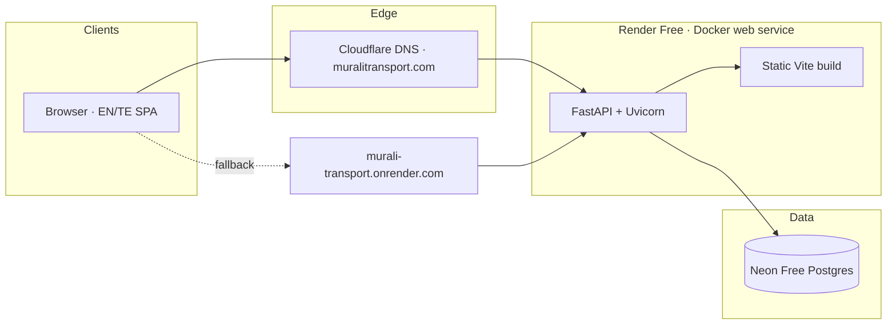
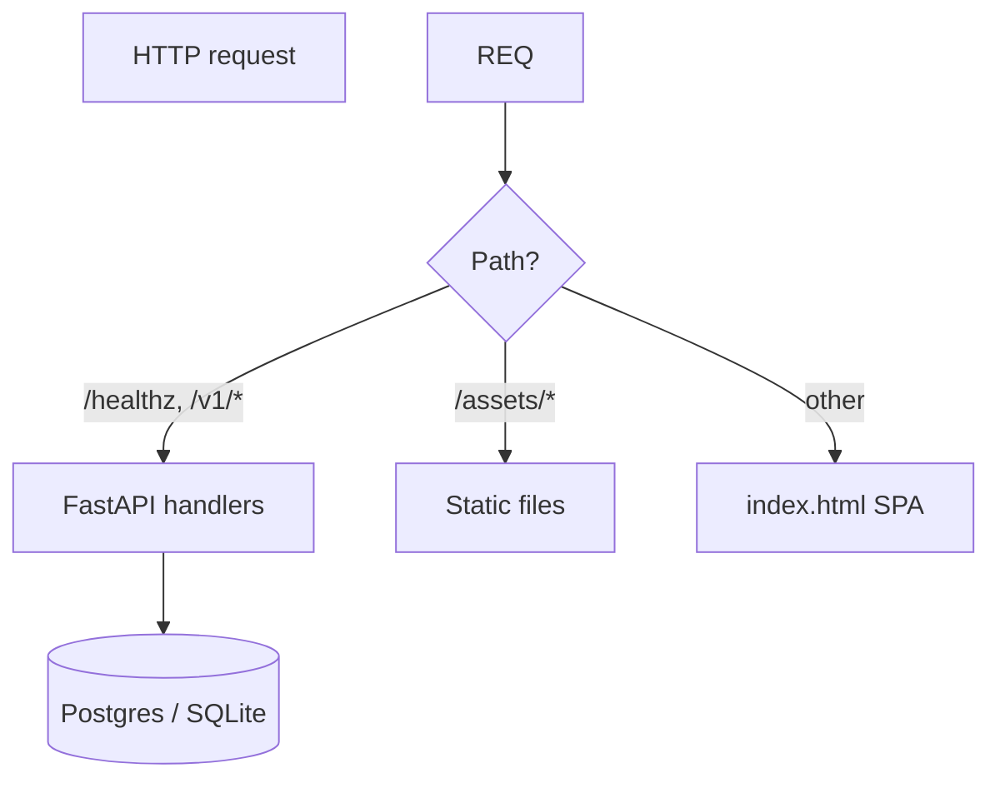
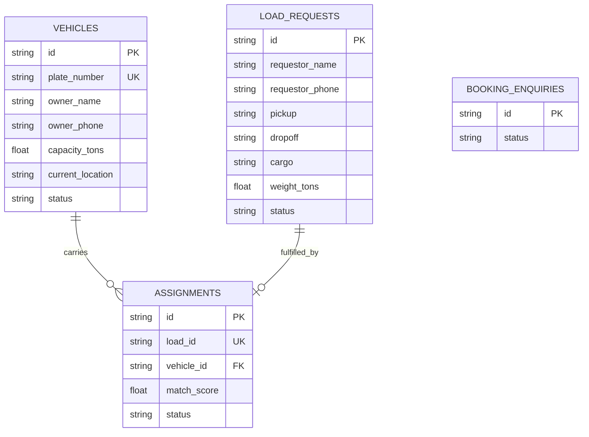
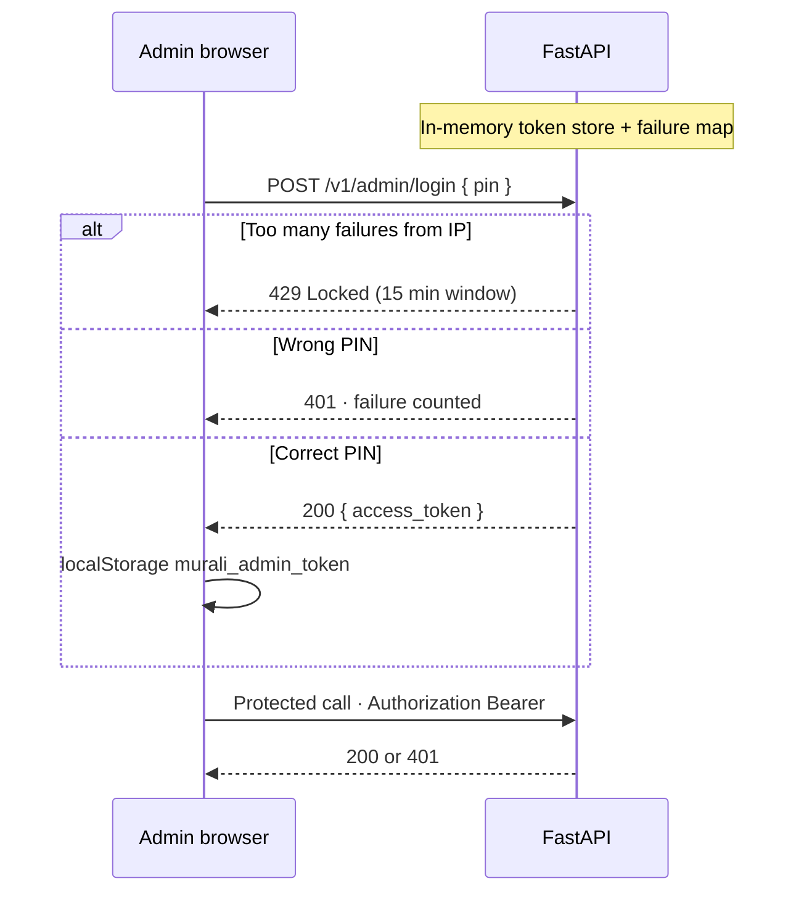

# Architecture

Murali Transport is a single-office lorry booking app for **Murali Office Miny Lorry Transport** (Dommeru). Load requestors post freight, lorry owners register vehicles, and office admin matches and assigns lorries by location.

## System overview



| Layer | Technology |
|-------|------------|
| Frontend | React 19, Vite 8, TypeScript, CSS (`apps/web`) |
| Backend | FastAPI, SQLAlchemy 2, Pydantic 2 (`apps/api`) |
| Database | Neon Postgres (prod) · SQLite (local default) |
| Hosting | Render Free Docker service (Oregon) |
| Domain | Cloudflare Registrar + DNS → `muralitransport.com` |

**Live URLs**

- Primary: https://muralitransport.com  
- Fallback: https://murali-transport.onrender.com  

---

## Repository layout

```
murali-transport/
├── apps/
│   ├── web/                 # React SPA
│   │   ├── src/App.tsx      # Portals + UI (no React Router)
│   │   ├── src/api.ts       # HTTP client
│   │   ├── src/content.ts   # Business copy EN/TE + routes map data
│   │   └── public/          # Hero images, static assets
│   └── api/
│       └── app/
│           ├── main.py      # HTTP routes + static mount
│           ├── models.py    # SQLAlchemy models
│           ├── db.py        # Engine / session
│           └── matching.py  # Load ↔ vehicle location scoring
├── docs/                    # This documentation
├── scripts/                 # Deploy helpers, DB backup
├── Dockerfile               # Multi-stage: build SPA → serve with API
├── docker-compose.yml
├── render.yaml              # Render blueprint
└── README.md
```

Root `package.json` npm workspaces cover `apps/web` only. The API is Python and is not an npm package.

---

## Runtime architecture

### Production (one container)

1. **Build stage** (`node:22`): Vite builds the SPA with `VITE_API_BASE=` (same-origin) and `VITE_BASE=/`.
2. **Runtime stage** (`python:3.12`): FastAPI serves:
   - JSON API under `/v1/*` and `/healthz`
   - Built assets from `/static` (mounted as `/assets`, `/`, SPA fallback)
3. Render injects `PORT`. Uvicorn binds `0.0.0.0:$PORT`.
4. Neon pooled `DATABASE_URL` is set in the Render dashboard.



### Local development

| Process | Port | Notes |
|---------|------|--------|
| Vite (`npm run dev`) | `5175` | Proxies `/v1` and `/healthz` → API |
| Uvicorn | `8000` | SQLite under `apps/api/data/` unless `DATABASE_URL` is set |

```bash
npm install && npm run dev
cd apps/api && python3.12 -m venv .venv && source .venv/bin/activate
pip install -r requirements.txt
uvicorn app.main:app --reload --port 8000
```

---

## Frontend architecture

The SPA is a **portal state machine**, not URL-routed pages.

| Portal | Purpose |
|--------|---------|
| `home` | Marketing, live board, routes map, CTAs |
| `about` | Office details, phones, maps, WhatsApp |
| `request` | Post a load form |
| `owner` | Register a lorry form |
| `admin` | PIN-locked desk: snapshot, loads, match, fleet, assignments |

Cross-cutting UI:

- Language toggle **EN / TE** (`content.ts` dictionaries)
- Live board refresh (~15s) for public lorries/loads
- Admin tabs with client-side search and pagination (8 per page)

---

## Backend architecture

### API surface

| Method | Path | Auth | Purpose |
|--------|------|------|---------|
| `GET` | `/healthz` | Public | Liveness |
| `GET` | `/v1/office` | Public | Office metadata |
| `GET` | `/v1/stats` | Public | Counts for market pulse |
| `GET` | `/v1/activity` | Public | Recent activity ticker |
| `POST` | `/v1/admin/login` | Public + rate limit | PIN → Bearer token |
| `POST` | `/v1/admin/logout` | Optional Bearer | Drop token |
| `POST` | `/v1/vehicles` | Public | Register lorry |
| `GET` | `/v1/vehicles` | Public | List / filter / search |
| `GET` | `/v1/vehicles/{id}` | Public | Get vehicle |
| `PATCH` | `/v1/vehicles/{id}/location` | Public | Update location/status |
| `POST` | `/v1/loads` | Public | Post load |
| `GET` | `/v1/loads` | Public | List / filter / search |
| `GET` | `/v1/loads/{id}` | Public | Get load |
| `GET` | `/v1/loads/{id}/suggestions` | Admin | Ranked vehicle matches |
| `POST` | `/v1/assignments` | Admin | Assign vehicle to open load |
| `GET` | `/v1/assignments` | Admin | List assignments |
| `POST` | `/v1/assignments/{id}/complete` | Admin | Mark delivered; free vehicle |
| `POST` | `/v1/bookings` | Public | Legacy enquiry (+ creates load) |
| `GET` | `/v1/bookings` | Public | List enquiries |
| `GET` | `/v1/bookings/{id}` | Public | Get enquiry |

CORS is open (`*`) because the SPA and API share origin in production.

### Domain model



**Vehicle status:** `available` · `assigned` · `in_transit` · `offline` · `pending_approval`  
**Load status:** `open` · `assigned` · `in_transit` · `delivered` · `cancelled`  
**Assignment status:** `assigned` · `in_transit` · `completed` · `cancelled`

### Matching engine

`matching.py` scores a vehicle’s `current_location` against a load’s `pickup`:

| Score band | Meaning |
|------------|---------|
| 1.0 | Exact place match |
| 0.85 | Substring / nearby |
| ≤0.75 | Shared tokens |
| 0.55 | Same regional corridor heuristic |
| 0.15 | Different area (still assignable) |

Admin suggestions sort by this score so Dommeru-belt and corridor lorries surface first.

---

## Security model



| Control | Detail |
|---------|--------|
| Admin PIN | `ADMIN_PIN` env (default local only; set on Render) |
| Rate limit | 5 failed logins / IP / 15 minutes (`ADMIN_LOGIN_MAX_ATTEMPTS`, `ADMIN_LOGIN_WINDOW_SEC`) |
| Tokens | Random Bearer tokens in process memory (lost on restart) |
| PIN compare | `secrets.compare_digest` |
| Client storage | `localStorage` key `murali_admin_token` |

Public vehicle/load endpoints are intentionally open for the office website model (no end-user accounts). Treat admin PIN as the primary control plane.

---

## Configuration

| Variable | Required in prod | Purpose |
|----------|------------------|---------|
| `DATABASE_URL` | Yes | Neon pooled Postgres URL |
| `ADMIN_PIN` | Yes | Admin desk unlock |
| `APP_URL` | Recommended | Public site URL (`https://muralitransport.com`) |
| `PORT` | Injected by Render | Listen port |
| `ADMIN_LOGIN_MAX_ATTEMPTS` | No | Default `5` |
| `ADMIN_LOGIN_WINDOW_SEC` | No | Default `900` |
| `VITE_API_BASE` | Build-time | Empty in Docker (same-origin) |

See also [DATABASE.md](./DATABASE.md) and [DEPLOY-FREE.md](./DEPLOY-FREE.md).

---

## Infrastructure & operations

| Concern | Approach |
|---------|----------|
| Deploy | Push `main` → Render auto-deploy (Docker) |
| Health | `GET /healthz` |
| Custom domain | Render custom domains + Cloudflare CNAME `@` / `www` → `murali-transport.onrender.com` |
| Suspend site | Render dashboard → **Suspend** service |
| Domain expiry | Cloudflare Registrar; Render `.onrender.com` URL remains as fallback |
| DB backup | `./scripts/backup-db.sh` (see [DATABASE.md](./DATABASE.md)) |

### Request path with custom domain

1. Browser → `muralitransport.com`
2. Cloudflare DNS resolves to Render (CNAME / flattened)
3. Render TLS terminates for the custom hostname
4. Container serves SPA + API
5. If the domain expires or DNS is removed, `murali-transport.onrender.com` still serves the same service

---

## Design constraints (product)

- Single Dommeru office — not a multi-desk marketplace
- Copy emphasizes office location + major hubs (Hyderabad, Visakhapatnam, Chennai, etc.)
- Bilingual EN/TE throughout public and form UI
- Free-tier stack: Render Free + Neon Free
