# User flows

End-to-end journeys for people using **Murali Transport Office** (Dommeru). The SPA switches portals in memory (`home` · `about` · `request` · `owner` · `admin`); deep links are not required for core flows.

## Actors

| Actor | Goal |
|-------|------|
| **Visitor** | Learn about the office, see routes, call/WhatsApp |
| **Load requestor** | Post cargo pickup/drop details so the office can assign a lorry |
| **Lorry owner** | Register a vehicle so the office can call for nearby loads |
| **Office admin** | Unlock the desk, match open loads to available lorries, complete trips |

---

## 1. Visitor — discover & contact

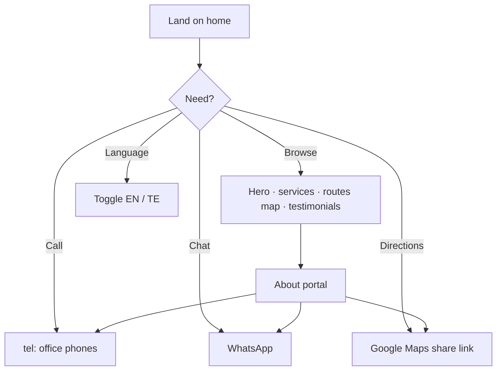

**Home highlights**

1. Brand hero and office positioning (Dommeru)
2. Market pulse / live board: available lorries + open loads
3. Role tiles: post load · register lorry · call office
4. Routes map: Dommeru hub → major cities
5. How it works + testimonials

**Outcome:** Visitor calls, messages WhatsApp, or starts a booking form.

---

## 2. Load requestor — post a load

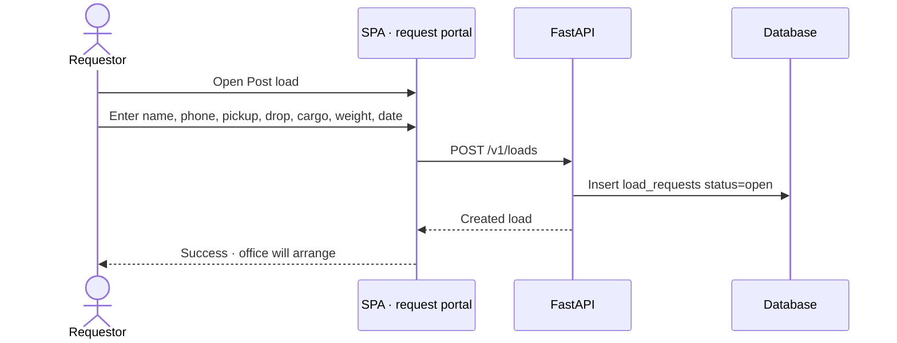

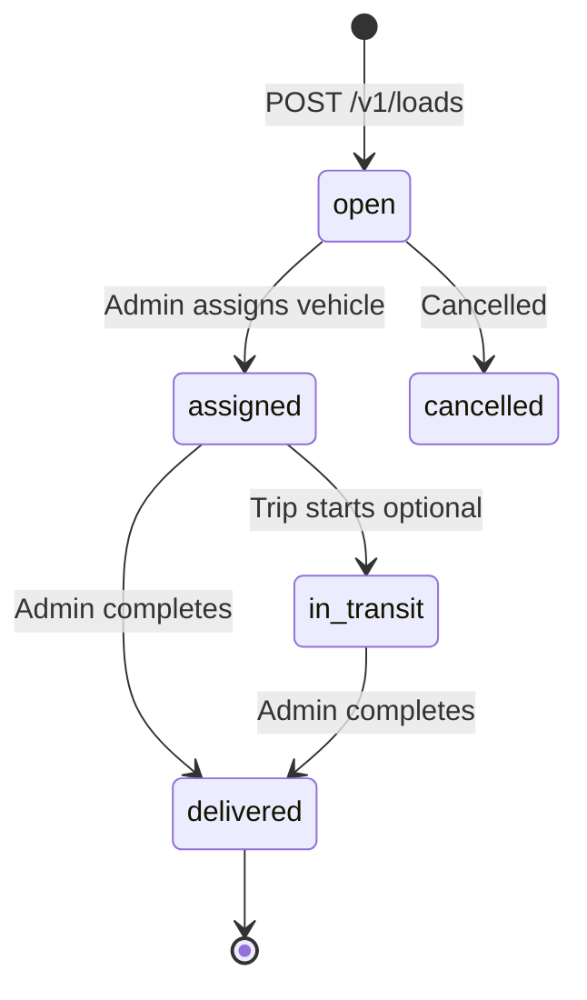

**Typical fields:** requestor name/phone, pickup, dropoff, cargo, weight (tons), vehicle preference, preferred date, notes.

**After submit:** Load appears on the public live board (open) and in Admin → Loads / Match.

---

## 3. Lorry owner — register a vehicle

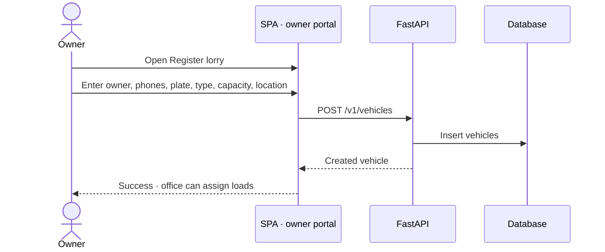

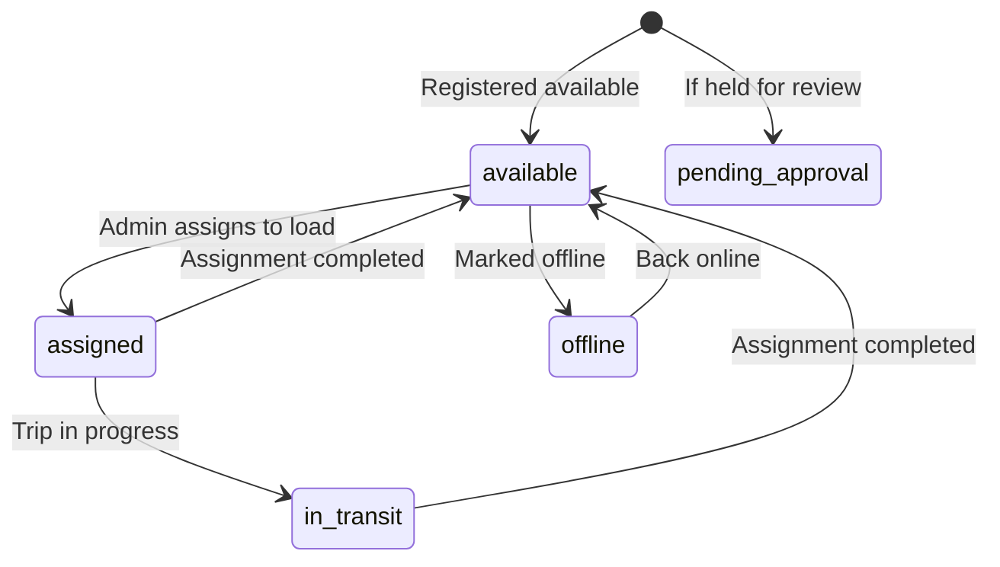

**Typical fields:** owner/driver contacts, plate number (unique), vehicle type (e.g. mini lorry), capacity tons, current location (default Dommeru), notes.

**After submit:** Vehicle can appear on the live “Available lorries” board and in Admin → Lorries / Match suggestions.

---

## 4. Quick-find from home

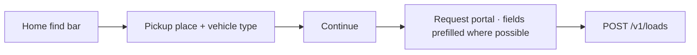

Reduces friction for callers who already know pickup and equipment type.

---

## 5. Office admin — unlock desk

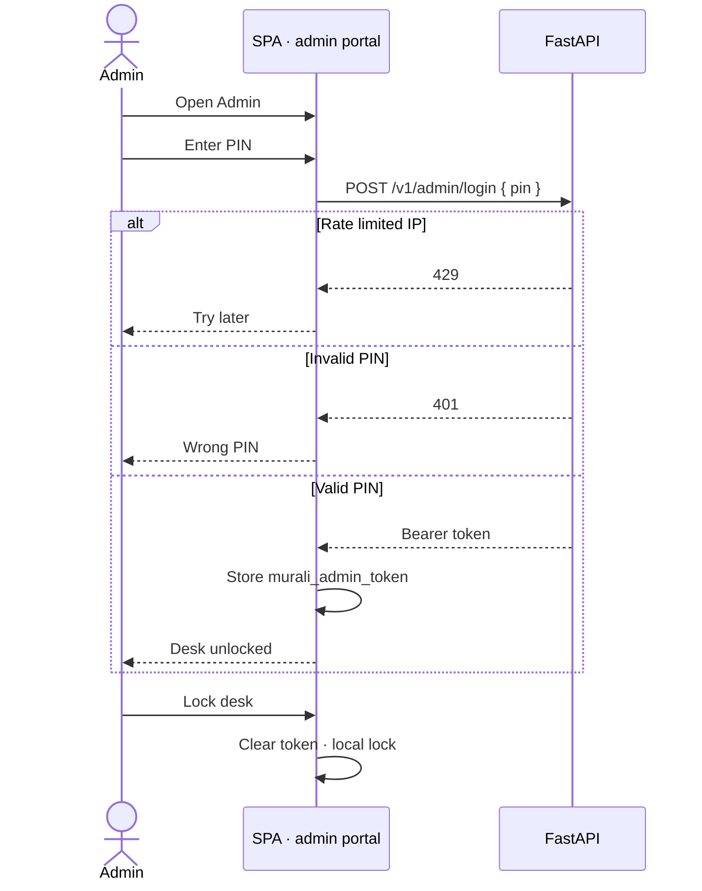

**Defaults:** PIN from `ADMIN_PIN` · max 5 failures / 15 minutes per IP.

**Note:** “Lock desk” clears the browser token. Server tokens also clear on process restart (in-memory store).

---

## 6. Office admin — match & assign

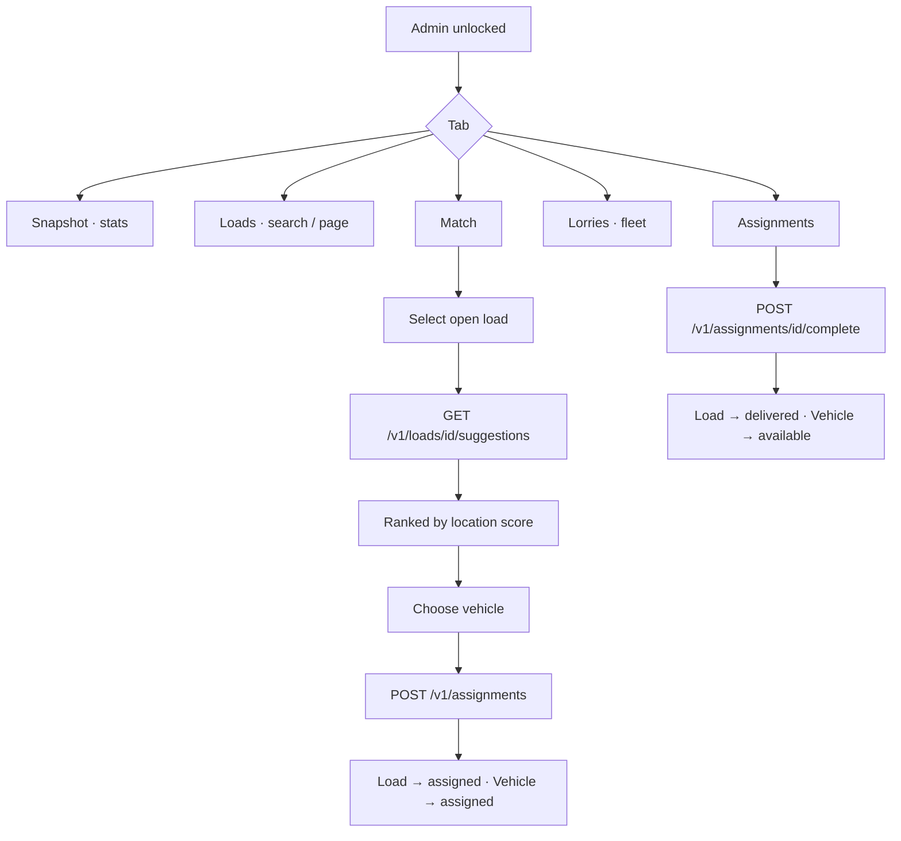

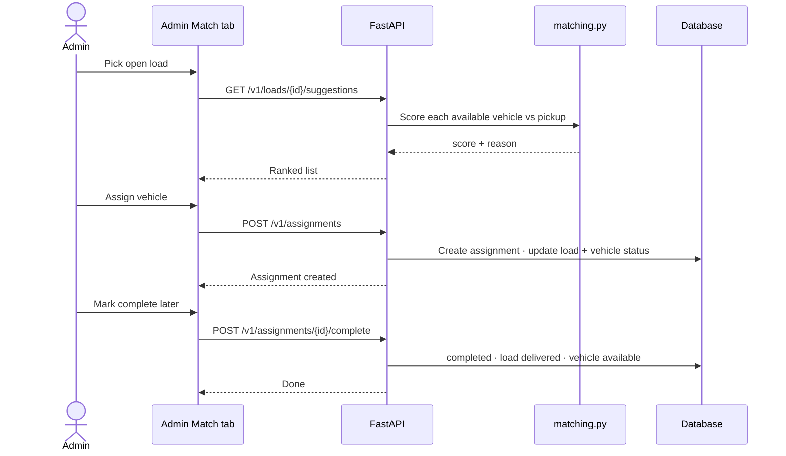

**Matching cues shown to admin:** exact match, nearby, shared tokens, same corridor, or different area (still assignable).

---

## 7. End-to-end booking lifecycle

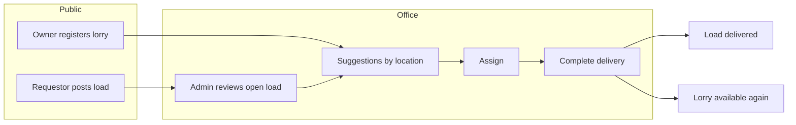

1. Requestor posts load → `open`
2. Owner has vehicle → `available`
3. Admin assigns → load `assigned`, vehicle `assigned`
4. Admin completes → load `delivered`, vehicle `available`

Optional contact channels (call / WhatsApp) run in parallel for same-day office dispatch.

---

## 8. Language & accessibility of copy

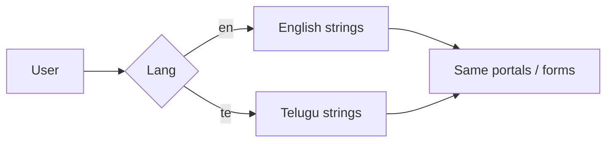

All primary CTAs, forms, admin chrome, and marketing sections pull from `content.ts` dictionaries. Switching language does not change portal or auth state.

---

## 9. Suspend / resume the product

Operational flow (not in-app):

1. Open Render → service **murali-transport**
2. **Suspend** → site stops for custom domain and `.onrender.com`
3. **Resume** when needed again

Domain billing on Cloudflare is independent of Render suspend.

---

## Related docs

- [ARCHITECTURE.md](./ARCHITECTURE.md) — components, API, data, deploy
- [DEPLOY-FREE.md](./DEPLOY-FREE.md) — Render + Neon setup
- [DATABASE.md](./DATABASE.md) — Neon IDs and backup
